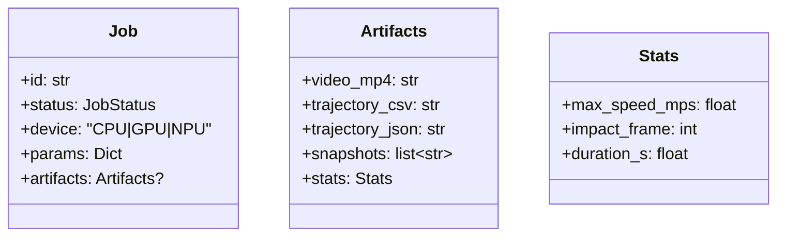
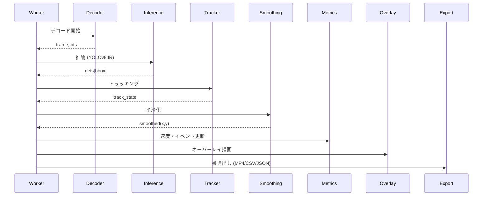
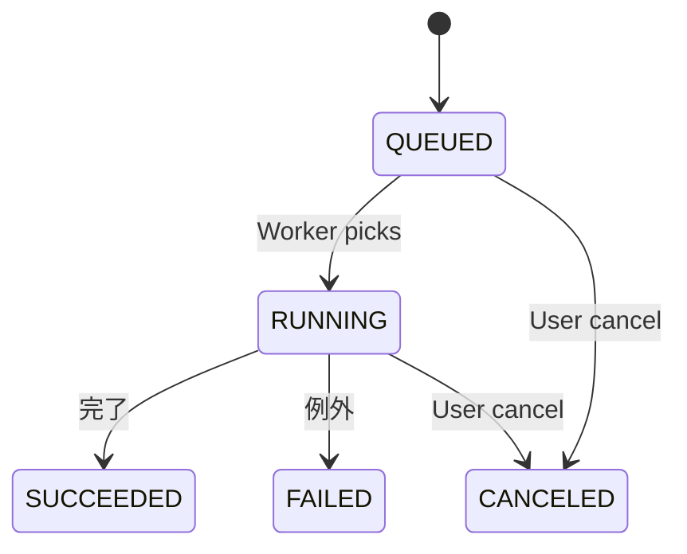

# ゴルフクラブヘッド軌道追跡システム ソフトウェアアーキテクチャ  
**バージョン**: v0.2  
**起案日**: 2025-10-08  

---

## 1. 全体像（コンテキスト & デプロイビュー）

```mermaid
flowchart LR
  subgraph Client["Web Browser (localhost)"]
    UI[Upload/Jobs/Player]
  end

  subgraph Server["AIPC / Localhost"]
    API[FastAPI API / Static UI]
    WS[WebSocket/SSE]
    JM[Job Manager]
    Q[Async Queue]
    W1[Worker 1]
    Wn[Worker N]
    subgraph Pipeline["Analysis Pipeline Module"]
      DEC[Decode]
      INF[OpenVINO Inference (YOLOv8 IR)]
      TRK[Tracker (Kalman + IOU/ByteTrack)]
      SMO[Smoothing]
      MET[Metrics (speed/impact)]
      OVL[Overlay]
      EXP[Export (MP4/CSV/JSON)]
    end
    FS[(Local FS)]
    LOG[(Logs/metrics)]
  end

  UI -- HTTP Upload --> API
  API -- create job --> JM --> Q
  Q --> W1 & Wn
  W1 & Wn --> Pipeline
  Pipeline --> FS
  W1 & Wn --> JM
  JM -- job status --> WS --> UI
  API -- results (URLs) --> UI
  API --> LOG
```

---

## 2. 論理アーキテクチャ（レイヤ & モジュール）

- **Interface Layer**
  - REST API: `/api/jobs`, `/healthz`  
  - WS/SSE: 進捗通知  
  - Web UI: HTML/JS, Canvas描画  

- **Application Layer**
  - Job Manager: ジョブ状態管理（QUEUED/RUNNING/SUCCEEDED/FAILED）  
  - Worker: バックグラウンド処理、並列制御  

- **Domain Layer（解析）**
  - Decoder: PyAV/FFmpeg によるデコード  
  - Inference: OpenVINO (YOLOv8 IR)  
  - Tracker: IOUアソシエーション + Kalman  
  - Smoothing: Savitzky–Golay 等  
  - Metrics: 速度・インパクト検出  
  - Overlay: 軌跡描画  
  - Exporter: MP4/CSV/JSON 出力  

- **Infrastructure Layer**
  - FS Layout: 入出力パス、保存規約  
  - Config: YAML/ENV 読み込み  
  - Logging: 構造化ログ、Prometheusメトリクス  

---

## 3. データモデル



---

## 4. API インターフェース

- `POST /api/jobs`: 動画アップロード & 解析開始  
- `GET /api/jobs/{id}`: ジョブ状態取得  
- `GET /api/jobs/{id}/results`: アーティファクトURL/統計取得  
- `WS /ws/jobs/{id}`: ジョブ進捗通知  
- `GET /api/jobs/{id}/video`: 解析済み動画取得  
- `GET /api/jobs/{id}/trajectory.(csv|json)`  
- `GET /healthz`, `GET /metrics`

---

## 5. パイプライン詳細



---

## 6. フロントエンド構成

- **アップロード画面**: 動画選択 → POST /api/jobs  
- **一覧画面**: ジョブ状態テーブル → 進捗（WS/SSE）  
- **結果画面**: `<video>` + `<canvas>` 同期描画  
  - `/video` で結果再生  
  - `/trajectory.json` を Canvas に重畳  

---

## 7. 並列制御

- **ワーカー数制御**:  
  - NPU: 1  
  - GPU: 2  
  - CPU: min(2, コア/2)  
- **キュー**: `asyncio.Queue`  
- **再開**: 中断時は CSV の最終フレームから再解析  

---

## 8. 設定例（YAML）

```yaml
runtime:
  device: GPU
  num_streams: 2
model:
  xml: models/clubhead.xml
  bin: models/clubhead.bin
infer:
  conf_thres: 0.35
  nms_iou: 0.45
batch:
  max_gpu_workers: 2
  max_cpu_workers: 2
  max_npu_workers: 1
calibration:
  scale_mm_per_px: 0.45
export:
  out_dir: outputs/
server:
  host: 127.0.0.1
  port: 8000
  auth: none
```

---

## 9. 観測性 & セキュリティ

- **ログ**: job_id, stage, fps, 推論時間を構造化出力  
- **メトリクス**: Prometheus 形式（job_total, fps, latency, queue_depth）  
- **セキュリティ**:  
  - デフォルトは localhost バインド  
  - 任意でトークン/BASIC 認証  
  - アップロードサイズ制限、保存期間クリーンアップ  

---

## 10. ジョブ状態遷移（FSM）


